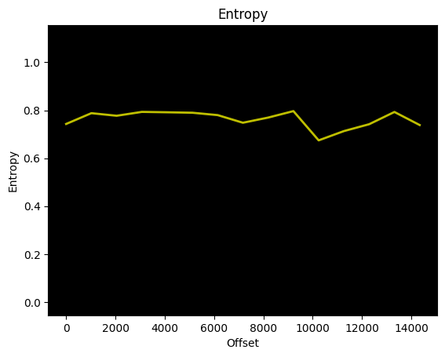

<p align="center"></p>

<h4 align="center">A simple yet easy to use library to communicate with the EFC-X9 (Product by ElmorLabs)</h4>

<p align="center"> </p>

<div align="center">
  <a href="https://github.com/Dr-Noob/cpufetch/blob/master/README.md#1-analyzing">
    
  </a>
</div>

<p align="center"></p>

# Table of contents
<!-- UPDATE with: doctoc --notitle README.md -->
<!-- START doctoc generated TOC please keep comment here to allow auto update -->
<!-- DON'T EDIT THIS SECTION, INSTEAD RE-RUN doctoc TO UPDATE -->


- [1. Analyzing FW](#1-analyzing-fw-v5)
  - [1.1 Entropy](#11-entropy)
  - [1.2 Strings](#11-strings)

<!-- END doctoc generated TOC please keep comment here to allow auto update -->

## 1. Analyzing FW v5
### 1.1 Entropy
The entropy of the given firmware v5 for the EFC-X9. All entropy values are under 0.8 which is a good hint that the
firmware isnot encrypted. Encrypted firmwares would be near the value 1.
<p align="center">

&nbsp;
</p>

### 1.2 Strings
To be really sure that the firmware is not encrypted, we output all strings with a length of at least 4 with the tool 'strings'.
Output:
```cmd
FpGU;
FpG-;
FWFNFEF
p x !
 x@!
C`pCF
`x !
`x@!
C`p}J
pCF[
x]I	xR
C q:K
H!iC
6	.H
C q8
H#kC
"AF(
C quI
!Y^pK
<0oN
 y !
C qTJ
C qk
l!qC[
l'wC
F y@!
C q	K
l pC
k2rC
l"rC
l"rC
"H!@F
"H!@F
l!qC[
C rx
`y !
C`qk
l"rC
I	xQ
@Zq z
l"rC
DKF[y
!Y^8
"H!@F
\0CF
"H!@F
!Y^8
`0CF
"H!@F
d0CF
"H!@F
l#^C
){RM(
C rEK
 z !
C rAI
6 pC
by@#
Cbqk
6"rC
C`qi
6 pC	
6!qC[
l pC
l"rC
l pC	
l!qC[
l"rC
"H!@F
k2rC
C`rk
l"rC
`z !
"jCl!qCR
`z@!
#kCl"rC
d"Zs
"jCl!qCR
#kCl"rC
j2rC
l"rC
"jCl!qCR
#kCl"rC
l"rC
C`rj
l!qCR
C`rk
l"rC
!z@"
EHP#
"$!80
CBXA
FWFNFEF
C p[FYp
H!#Cp
C p	K
 x !
L!x@"
M@#+p
N "1
 1 "
@1 "
`1 "
C+T x
C p0
FWFNFEF
 x !
#x@"
`x@!
`x !
FWFNFEF
`x@!
05KFYF]T
 x !
C`p[F
3 "IFXF
C p[F
F.#IF
 x@!
C p_F
XFMF_
F`x !
C`p[F
305JFYFUT
Cap9
vCv;3
pSx[
 x !
C pZ
 x@"
C p	"
C pp
"x #
#x@"
FWFNFEF
`x !
`x@!
 x@!
C ps
l!yC[
l!yC[
C`pBFs
l!yC[
 x !
C`ps
l"zC
FcD_{ x
C p9
PK_U
SF_]
l"zC
l"zC
FcD[
l!yC[
SCbFQ
l"zC
	L x
C`pzKwJ
`x !
C`plK
x4+#
phK[x
C`pLM
"MI(
 x !
C p*!FH
 x@!
p/JQx4J
`x@!
#K#J
xBBBA
K7"Z
#x "
 x@!
^L^K[{
C pYK
pUJQh
C pNK
C pIK
C pCK
 x !
 x@!
C p6JQh
CS`5K
p1J x
C`p-K
`x@!
C`p%J
`x !
C pJ
 x #
C p+
 x@!
C!pp
=L=K
C p6K
C`p1J
1H.I/O
C`p!K
 x !
 x@!
FWFNFEF
/L0M
&d%3
MrXF
q`FX
]q2 
ISFZF
C p	M
 x !
 x@!
 L!M
C!p@6fE
 x !
 x@!
 x !
 x@!
C`phBhA
TK[Y
C!pHKXC
 x !
C p:K
C`pB
`x !
C`p$H
C#KSC
 x@!
p&3Sp
`x@!
6L6J
a1K2JZ`
C p ;
EFC-X9
FEXT 
   NC
IIN 
VIN 
MODE
TEMP
SRC 
FIXD
DUTY
FEXT
MIN 
MAX 
RAMP
BACK
SAVE
LOAD
RESET
"L"K
aS~[
pS~[
+L x
C p)K
:@!ZT
 XT?0
1ZT,90%YU
5ZU12
1-=]T
1ZT0
s::Zs
C p@# x
+xS@
C!p0
sCoCfCeC
FAN1
FAN2
FAN3
FAN4
FAN5
FAN6
FAN7
FAN8
FAN9
 ElmorLabs EFC-X9
AUTO
```

